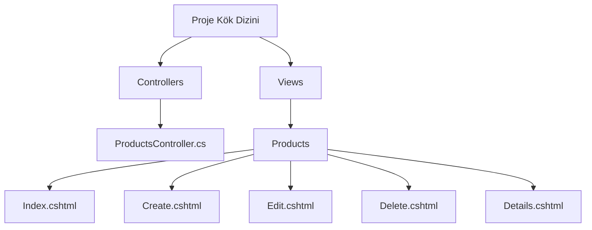

# ASP.NET Core’da Scaffold Komutları ile Controller, View ve Razor Page Oluşturma

ASP.NET Core’da Scaffold komutları ile controller, view ve Razor Page gibi temel yapıları otomatik oluşturabilirsiniz.

---

## ASP.NET Core’da Komut Satırından Controller Oluşturma (Scaffold)

### 1. Öncelikle `dotnet-aspnet-codegenerator` aracını kur:

```bash
dotnet tool install -g dotnet-aspnet-codegenerator
```

### 2. Projende gerekli paketlerin olduğundan emin ol:

```bash
dotnet add package Microsoft.VisualStudio.Web.CodeGeneration.Design
dotnet add package Microsoft.EntityFrameworkCore.Design
```

### 3. Controller Oluşturma Örneği:
Diyelim Product adında bir modelin var ve AppDbContext adında DbContext’in:

```bash
dotnet aspnet-codegenerator controller -name ProductsController -m Product -dc AppDbContext --relativeFolderPath Controllers --useDefaultLayout --referenceScriptLibraries
```
#### Açıklamalar:

> `-name`: Oluşturulacak controller adı  
>
> `-m`: Model sınıfı adı
>
> `-dc`: DbContext sınıfı adı
> 
> `--relativeFolderPath`: Controller’ın kaydedileceği klasör
> 
> `--useDefaultLayout`: Varsayılan layout’u kullan
> 
> `--referenceScriptLibraries`: Script referanslarını ekle

### 4. Scaffold Komutu Çalıştırıldıktan Sonra:
`Controllers/ProductsController.cs` `Views/Products` klasörü altında CRUD view dosyaları oluşturulur.



### Özet:

> - Controller oluştur	`dotnet aspnet-codegenerator controller -name ProductsController -m Product -dc AppDbContext`
>   
>- Razor Page CRUD	`dotnet aspnet-codegenerator razorpage -m Product -dc AppDbContext -outDir Pages/Products`
